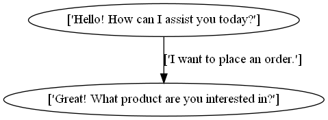

Research
========

Key Concepts
~~~~~~~~~~~~

A **dialog graph** is a structured, graph-based representation of conversational data, where **nodes** represent key elements such 
as utterances, intents, or states, and **edges** define the transitions between these elements.

   Simple example of dialog graph

:doc:`Data collections <./research/data_collections>`
~~~~~~~~~~~~~~~~~~~~~~~~~~~~~~~~~~~~~~~~~~~~~~~~~~~~~~

To test the proposed graph creation methods, several task-oriented dialog datasets were examined and one dataset was collected. This page includes all necessary information
about available data.

.. toctree::
   :hidden:

   research/data_collections

